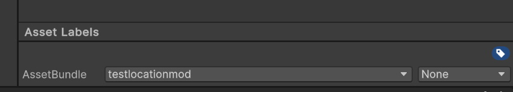
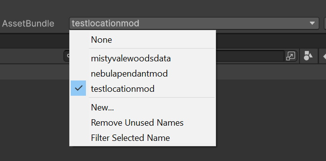
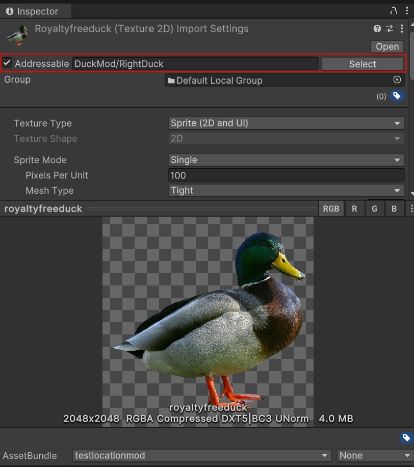

# Section 3 - Deploying Your First Mod
Deploying your first mod is extremely easy, but there are some steps you will need to closely follow to make sure things end up as you expect them to.

The mod exporter is a WIP, so there are some minor hiccups in this process that you need to be wary of.

Firstly, mods are exported through asset bundles. Asset bundles are compressed files, which are a lot like a zip file, will contain all of your assets for the game compiles all of the mods at startup.

## Part 1 - Tagging Bundled Assets
To get the exporter to actually bundle your assets, click them, and then

Click this "Asset Labels" section at the bottom of your asset top pop it open

Once open you should see a drop down beside "AssetBundle", this dropdown will contain the ability to untag that asset for export by selecting "None", as well as tagging it for bundling into any of the created/existing bundle tags.

To create a new mod bundle, simply select "New...". Name it whatever you'd like, this is how the file will be presented to players so probably try to name it something important or unique to your mod.

Once you have tagged one asset, you will need to tag everything else. Make sure anything you want to export with your mod is tagged with the same asset bundle tag.

# Part 2 - Image Addressable(s)
Once everything is tagged, there's one more catch. Images need to be marked "Addressable".

This is due to how assets are loaded through the bundler, even native content in the game uses the Addressable system to be able to give modder's access to the full image library.

Each image will need its own unique path, I highly recommend you name the Addressable path of your assets "ModName/AssetName". There cannot be duplicate paths between mods or native content, otherwise that path will be overwritten. If you overwrite a native path, all mods and native content using that path will instead use your modded path. If another mod uses the same path as yours, depending on load order your path could be overwritten, etc.

Simply check the "Addressable" box and type in the path you'd like to use.

# Part 3 - Bundling & Exporting Your Mod
Now the easy part! Once everything is bundled, simply right click your project folder and press "Build Asset Bundles".
Can't find the build button? Don't worry I put it in like so many other spots!
You can find it in the top left under:
Assets/Build Asset Bundles
Tools/Build Asset Bundles
Window/Build Asset Bundles
Asteria/Deploy Mod
Tools/Deploy Mod

Every one of the buttons does the same thing, but it's in all of these spots so that it's impossible to not find it!

Upon clicking the button a build of all of your content will start. If there are any errors they will show up in the Console window. Otherwise, your mod will be built to the "AssetBundles" folder.

# Part 4 - Getting Your Mod In The Game
Once your mod is built, you probably want to try it out!
Simply open the "AssetBundles" folder in explorer. You can do this by right-clicking in the project window and pressing "Show in Explorer".

Now for a little hiccup as mentioned above. Some operating systems fail to tag the right extension onto the end of the mod file. Find your mod you built in your "AssetBundles" folder (In Windows Explorer) and rename it <code>modname.assetbundle</code>. We are looking to make sure the <code>.assetbundle</code> extension is on the end of the file. If it is not, the game will not recognize the file and will ignore it when importing mods.

Once your asset bundle is named correctly and good to go, simply go to your games directory, and drop the mod into the "Mods" folder. Run the game and from there try out your mod, that may require using console commands to spawn in an item, etc. if you did not inject a location, more on how to do that will be within this documentation.