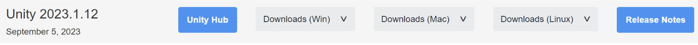

# Section 1 - Getting Started

## Overview
The modding system for Asteria consists of two main parts. First, there is the mod loader, which is a part of the game itself. It has the job of reading asset bundles. Second, there is the mod exporter. This tool takes the binary data from your mod and packs it into an asset bundle that the game can use. After creating a mod it will be your job to distribute it for players to then access.

As of right now there is not an official platform for sharing your mods. We will look into finding a reliable spot in the near future. Steam Workshop will be supported upon the games release.

The method you choose to share your mod with others is completely up to you. Currently, and for the foreseeable future, we do not have any official channels or methods for mod distribution. Whether you decide to charge for access to your mod, or publish it to a public platform is entirely your choice. It's important to understand that mod creators are the owners of their mods. This means that any issues caused by a mod, including damage to a user's game or infringement of copyright laws, are the responsibility of the mod's creator. The Asteria team cannot be held accountable for these issues or for how end-users utilize the modding tools provided. The tools we offer to mod developers are very basic and straightforward.

## Setup
Setting up the SDK (software development kit) is very simple.

Step 1: Install Unity v2023.1.12f1 from: https://unity.com/releases/editor/archive

<i>It’s highly recommended you download the Unity Hub, create a Unity account with a free personal license and press the “Unity Hub” button from the archive page to avoid any possible issues from here-on.</i>

# Setup For Manual Updates:

Step 2: Download the SDK package file from here: https://github.com/JusticeShultz/Asteria-Modding-SDK/releases

Step 3: Create a new Unity project. Make sure you are creating this project with Unity v2023.1.12f1

Step 4: Open the newly created project, and then either double click the downloaded SDK package, or drag and drop it into the editor window. This will start the import process, import everything from the SDK package file.

To update using this method, you will need to download the latest package from the GitHub and then import it to Unity, it will overwrite any old files. If you get errors while updating, delete the entire SDK from the project and re-import the package. Packages do not delete any content that might have been deleted with an update, so a full re-instlal of the SDK may sometimes be required. The method below will automatically delete files when there's an update though:

# Setup For Easy Updates & No Packages
For those of you that would like a simpler update method, consider following the install steps below instead.

Step 1: Download Git from here: https://git-scm.com/downloads

Step 2: Create a new folder somewhere, such as your desktop, downloads folder, documents folder, etc.

Step 3: In that folder, right click it and press "Open Git Bash Here". If you do not see this option, confirm you installed Git. If you can only open Git Bash through your search menu, then open it and navigate to your newly created folder by doing "cd pathname".

Step 4: Once Git Bash is open and is navigated to the folder, copy this command and: <b>right click > paste</b> it into the console: <code>git clone https://github.com/JusticeShultz/Asteria-Modding-SDK.git </code>

Step 5: Open Unity Hub, press "Add" and find the folder you just pulled the project to. Open that folder and press "Open".

Step 6: If all goes well you should be up-to-date with the package install method. To easily get downloads, simply open Git Bash like you did before in the newly pulled down project location, and type the command <code>git pull</code>. This will grab the latest install version of the project.

## Now that you're all setup, move along to: [Section 2 - Scriptable Types](../scriptabletypes/index)