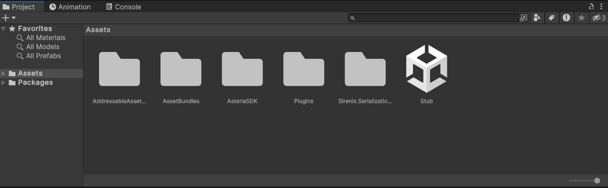
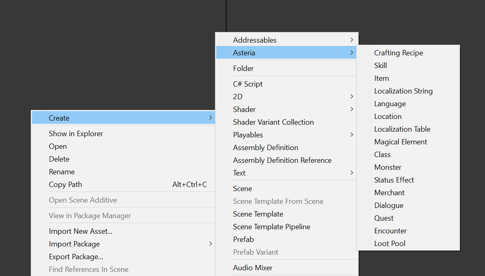

# Section 2 - Scriptable Types

Within the modded SDK a copy of every script used within the game is provided as a stub file. This means that they will actually function as expected when loaded in game, but all of the code is stripped out of them in the SDK.

This means that basic functionalities are left for mod developers, and any code changes will need to be done either with a new component that you bundle in your mod, or a third party decompiler and injecting tool. It's at a mod makers discretion if they would like to do this, but it's highly recommended for those that are new to modded to stick to the tools that are provided for the simplest experience.

## Scriptable Types & What They Are
The modding SDK is built around Scriptable Objects. Scriptable Objects are basically chunks of YAML data which inherit variables and logic from a script. In this case the stub scripts of each scriptable object are provided, so all you need to do is click buttons to create new scriptable assets.

To get started creating assets, find your project section

Within this project folder, navigate to the "AssetBundles" folder by double-clicking it.

Then go to the "Data" folder by double-clicking it. Within here you will find some demo content to look at. I highly recommend taking a look at how things look.

# Creating New Scriptable Types
Now you're probably wondering at this point, "how the heck do I make an item or a giant murder machine monster?". To do this all you need to do is right click in the Data folder (or whatever directory you wish to work in) and go to:

Create > Asteria > Scriptable Type

Once you click one of those options, simply name your asset, and you're good to go.

Documentation on the properties of these scriptable types are available within this documentation.

# Ready to try deploying your mod and testing it in game?
# [Section 3 - Deploying Your First Mod](../scriptabletypes/index)